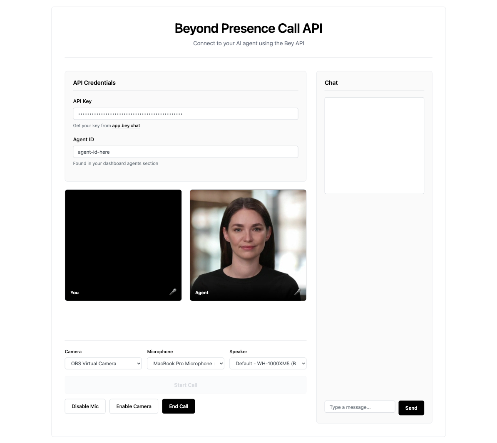

# Bey Call API Example

A simple, interactive example demonstrating how to use the Beyond Presence Call API to connect users with AI agents through LiveKit.



## Overview

The LiveKit-based implementation of our API provides a streamlined approach to integrating interactive avatars into web applications. This example demonstrates using the LiveKit browser SDK, but you can use **any LiveKit client SDK or UI components** based on your stack.

### Flexible Integration Options

- **Client SDKs**: Use LiveKit SDKs for Browser, iOS/macOS/visionOS, Android, Flutter, React Native, Rust, Node.js, Python, Unity, Unity (WebGL), or ESP32
- **UI Components**: Leverage pre-built UI components for React, Android Compose, SwiftUI, or Flutter
- **Agent Frameworks**: For advanced use cases, LiveKit officially supports our plugin for both Python and Node.js agents frameworks

This example shows how to:
- Call the Beyond Presence API to create a new call session
- Receive LiveKit connection credentials
- Connect to a LiveKit room with audio/video
- Interact with the managed agent in real-time
- Switch camera, microphone, and speaker devices
- Send chat messages during the call

## Prerequisites

Before running this example, you'll need:

1. **Beyond Presence Account**: Sign up at [app.bey.chat](https://app.bey.chat)
2. **API Key**: Get your API key from the Beyond Presence dashboard
3. **Agent ID**: Create an agent and note its ID from the dashboard or create an agent using our API.
4. **Node.js**: Version 18 or higher

## Setup Instructions

### 1. Install Dependencies

```bash
npm install
```

### 2. Run the Development Server

```bash
npm run dev
```

This will start a local development server (typically at `http://localhost:5173`).

### 3. Open in Browser

Navigate to the URL shown in your terminal (e.g., `http://localhost:5173`).

## Usage

1. **Enter Credentials**
   - Paste your Beyond Presence API key in the "API Key" field
   - Enter your Agent ID in the "Agent ID" field

2. **Start Call**
   - Click the "Start Call" button
   - The app will:
     - Call the Bey API to create a new call session
     - Receive LiveKit connection credentials
     - Automatically connect to the LiveKit room

3. **Interact with Your Agent**
   - Click "Enable Mic" to allow your microphone
   - Click "Enable Camera" to share your video (optional)
   - Use the chat box to send text messages
   - The agent will appear in the participants area when connected

4. **End Call**
   - Click "End Call" to disconnect from the session

## API Reference

### Bey Call API Endpoint

```
POST https://api.bey.dev/v1/calls
```

**Headers:**
```json
{
  "Content-Type": "application/json",
  "x-api-key": "your-api-key"
}
```

**Request Body:**
```json
{
  "agent_id": "your-agent-id"
}
```

**Response:**
```json
{
  "id": "call-id",
  "agent_id": "agent-id",
  "tags": {},
  "started_at": "2025-10-28T10:31:25.159564",
  "ended_at": "2025-10-28T10:31:25.159564",
  "livekit_url": "wss://livekit.bey.chat",
  "livekit_token": "livekit-token"
}
```

## Project Structure

```
call-api/
├── index.html       # Main HTML interface
├── demo.ts          # TypeScript application logic
├── styles.css       # CSS styling
├── package.json     # Project dependencies
├── tsconfig.json    # TypeScript configuration
└── README.md        # This file
```


## Technologies Used

- **TypeScript** - Type-safe JavaScript
- **LiveKit Client SDK** - WebRTC communication
- **Vite** - Fast build tool and dev server
- **Bootstrap** - UI styling framework

## Troubleshooting

### API Connection Issues

If you encounter API errors:
- Verify your API key is correct
- Check that your Agent ID exists in your dashboard


### Media Permission Issues

If camera/microphone don't work:
- Check browser permissions for camera/microphone access
- Ensure you're running on HTTPS or localhost
- Try a different browser (Chrome/Edge recommended)

### Connection Issues

If LiveKit connection fails:
- Check browser console for detailed error messages
- Verify your firewall isn't blocking WebSocket connections
- Ensure you have a stable internet connection

## LiveKit Ecosystem

Beyond Presence integrates seamlessly with the entire LiveKit ecosystem:

<table>
<thead><tr><th colspan="2">LiveKit Ecosystem</th></tr></thead>
<tbody>
<tr><td>Web & Mobile SDKs</td><td><b><a href="https://github.com/livekit/client-sdk-js">Browser</a></b> · <a href="https://github.com/livekit/client-sdk-swift">iOS/macOS/visionOS</a> · <a href="https://github.com/livekit/client-sdk-android">Android</a> · <a href="https://github.com/livekit/client-sdk-flutter">Flutter</a> · <a href="https://github.com/livekit/client-sdk-react-native">React Native</a></td></tr>
<tr><td>Other Platforms SDKs</td><td><a href="https://github.com/livekit/rust-sdks">Rust</a> · <a href="https://github.com/livekit/node-sdks">Node.js</a> · <a href="https://github.com/livekit/python-sdks">Python</a> · <a href="https://github.com/livekit/client-sdk-unity">Unity</a> · <a href="https://github.com/livekit/client-sdk-unity-web">Unity (WebGL)</a> · <a href="https://github.com/livekit/client-sdk-esp32">ESP32</a></td></tr>
<tr><td>UI Components</td><td><a href="https://github.com/livekit/components-js">React</a> · <a href="https://github.com/livekit/components-android">Android Compose</a> · <a href="https://github.com/livekit/components-swift">SwiftUI</a> · <a href="https://github.com/livekit/components-flutter">Flutter</a></td></tr>
<tr><td>Agents Frameworks</td><td><a href="https://github.com/livekit/agents">Python</a> · <a href="https://github.com/livekit/agents-js">Node.js</a> · <a href="https://github.com/livekit/agent-playground">Playground</a></td></tr>
</tbody>
</table>

**Beyond Presence Plugin**: Our official plugins are available for both [Python](https://docs.livekit.io/agents/models/avatar/plugins/bey/) and [Node.js](https://www.npmjs.com/package/@livekit/agents-plugin-bey) agents frameworks, enabling advanced integration scenarios.

## Resources

- [Beyond Presence Documentation](https://docs.bey.dev)
- [Beyond Presence API Reference](https://docs.bey.dev/api-reference)
- [LiveKit Documentation](https://docs.livekit.io)
- [LiveKit Agents Framework](https://docs.livekit.io/agents/)
- [Join our Discord Community](https://bey.dev/community)

## Support

Need help? Reach out:
- Email: <support@beyondpresence.ai>
- Discord: [bey.dev/community](https://bey.dev/community)

## License

This example is provided as-is for demonstration purposes.
